# Auto-Code Tracing System: MCP Breakdown & Integration Architecture

## MCP (Microservice Component Patterns) Breakdown

### 1. **Configuration Management Service (CMS)**
- **Purpose**: Centralized configuration, environment management, service discovery
- **Responsibilities**:
  - Load/validate configuration files (YAML/JSON)
  - Environment variable resolution
  - LLM provider configuration
  - Service-specific settings
  - Feature flags for debug activation
- **Interfaces**: REST API, file watcher, environment resolver
- **Data**: Configuration schemas, service registry, feature flags

### 2. **Language Detection & Parser Service (LDPS)**
- **Purpose**: Identify programming languages and parse code structure
- **Responsibilities**:
  - File extension to language mapping
  - Syntax tree parsing for multiple languages
  - Code snippet extraction and classification
  - Dependency analysis between code elements
- **Interfaces**: File processor, syntax analyzer, snippet generator
- **Data**: Language grammars, parsing rules, code metadata

### 3. **Debug Function Registry Service (DFRS)**
- **Purpose**: Maintain catalog of debug functions and templates
- **Responsibilities**:
  - Debug function definitions per language
  - Function signature validation
  - Template versioning and updates
  - Dependency requirement tracking
- **Interfaces**: Function catalog API, template retrieval, validation service
- **Data**: Function specifications, template libraries, dependency graphs

### 4. **LLM Integration Service (LIS)**
- **Purpose**: Abstract LLM interactions and prompt management
- **Responsibilities**:
  - Multi-provider LLM abstraction (OpenAI, Claude, local)
  - Prompt engineering and optimization
  - Response parsing and validation
  - Token usage tracking and rate limiting
- **Interfaces**: LLM provider APIs, prompt processor, response validator
- **Data**: Prompt templates, provider configurations, usage metrics

### 5. **Code Instrumentation Service (CIS)**
- **Purpose**: Generate instrumented code using LLM and templates
- **Responsibilities**:
  - Code snippet processing
  - Context-aware instrumentation decisions
  - LLM prompt generation for code transformation
  - Response validation and cleanup
- **Interfaces**: Code processor, instrumentation engine, quality validator
- **Data**: Instrumentation patterns, context rules, validation schemas

### 6. **Debug Module Generator Service (DMGS)**
- **Purpose**: Create language-specific debug function implementations
- **Responsibilities**:
  - Generate debug function implementations
  - Language-specific module assembly
  - Template customization and variable substitution
  - Module validation and testing
- **Interfaces**: Template processor, module assembler, validator
- **Data**: Function implementations, module templates, test cases

### 7. **Build Verification Service (BVS)**
- **Purpose**: Compile and validate instrumented projects
- **Responsibilities**:
  - Multi-language build execution
  - Compilation error parsing and classification
  - Build artifact management
  - Performance impact measurement
- **Interfaces**: Build executor, error analyzer, artifact manager
- **Data**: Build configurations, error patterns, performance metrics

### 8. **Error Analysis & Recovery Service (EARS)**
- **Purpose**: Analyze build failures and generate fixes
- **Responsibilities**:
  - Parse compilation errors using regex patterns
  - Classify errors by type and severity
  - Generate targeted fix strategies
  - Apply fixes and retry builds
- **Interfaces**: Error parser, fix generator, retry coordinator
- **Data**: Error patterns, fix templates, success metrics

### 9. **File System Management Service (FSMS)**
- **Purpose**: Handle file operations, directory structure, and state tracking
- **Responsibilities**:
  - Debug directory structure creation
  - File timestamp tracking and change detection
  - Atomic file operations with rollback
  - Backup and recovery management
- **Interfaces**: File operations API, state tracker, backup manager
- **Data**: File metadata, directory structures, change logs

### 10. **Cache Management Service (CMS2)**
- **Purpose**: Optimize performance through intelligent caching
- **Responsibilities**:
  - LLM response caching
  - Build result caching
  - Template and function caching
  - Cache invalidation strategies
- **Interfaces**: Cache API, invalidation service, metrics collector
- **Data**: Cached responses, metadata, hit/miss statistics

### 11. **Orchestration & Workflow Service (OWS)**
- **Purpose**: Coordinate the entire instrumentation pipeline
- **Responsibilities**:
  - Pipeline execution coordination
  - Service dependency management
  - Error handling and retry logic
  - Progress tracking and reporting
- **Interfaces**: Workflow orchestrator, progress tracker, error handler
- **Data**: Workflow definitions, execution state, service health

### 12. **Monitoring & Observability Service (MOS)**
- **Purpose**: Track system performance and health
- **Responsibilities**:
  - Service health monitoring
  - Performance metrics collection
  - Error tracking and alerting
  - Usage analytics and reporting
- **Interfaces**: Metrics collector, health checker, alert manager
- **Data**: Metrics, logs, alerts, dashboards

## Sequence Diagram: Complete Instrumentation Pipeline

```mermaid
sequenceDiagram
    participant User
    participant OWS as Orchestration Service
    participant CMS as Config Management
    participant FSMS as File System Mgmt
    participant LDPS as Language Parser
    participant DFRS as Debug Registry
    participant DMGS as Debug Module Gen
    participant LIS as LLM Integration
    participant CIS as Code Instrumentation
    participant BVS as Build Verification
    participant EARS as Error Analysis
    participant CMS2 as Cache Management
    participant MOS as Monitoring

    User->>OWS: Start instrumentation (service_dir, service_name)
    
    Note over OWS: Initialization Phase
    OWS->>CMS: Load configuration
    CMS-->>OWS: Config loaded
    OWS->>MOS: Log pipeline start
    OWS->>FSMS: Setup debug directory structure
    FSMS-->>OWS: Directory structure ready
    
    Note over OWS: Discovery Phase
    OWS->>FSMS: Scan source files
    FSMS->>LDPS: Identify languages for files
    LDPS-->>FSMS: Language classifications
    FSMS-->>OWS: File inventory by language
    
    Note over OWS: Debug Module Creation Phase
    loop For each language
        OWS->>DFRS: Get debug function specs for language
        DFRS-->>OWS: Function specifications
        OWS->>CMS2: Check cached debug module
        alt Cache miss
            CMS2-->>OWS: Not cached
            OWS->>DMGS: Generate debug module
            DMGS->>LIS: Generate function implementations
            LIS-->>DMGS: Generated functions
            DMGS->>FSMS: Write debug module
            DMGS-->>OWS: Module created
            OWS->>CMS2: Cache debug module
        else Cache hit
            CMS2-->>OWS: Cached module
            OWS->>FSMS: Use cached debug module
        end
    end
    
    Note over OWS: Code Processing Phase
    loop For each source file
        OWS->>CMS2: Check if file needs processing
        alt File up-to-date
            CMS2-->>OWS: Skip file
        else File needs processing
            CMS2-->>OWS: Process required
            OWS->>LDPS: Parse file into snippets
            LDPS-->>OWS: Code snippets
            
            loop For each snippet
                OWS->>CIS: Instrument snippet
                CIS->>DFRS: Get recommended debug functions
                DFRS-->>CIS: Function recommendations
                CIS->>LIS: Generate instrumented code
                LIS-->>CIS: Instrumented snippet
                CIS-->>OWS: Processed snippet
            end
            
            OWS->>CIS: Reconstruct complete file
            CIS-->>OWS: Complete instrumented file
            OWS->>FSMS: Write debug file
            OWS->>CMS2: Update file cache
        end
    end
    
    Note over OWS: Build Verification Phase
    loop Max 3 attempts
        OWS->>BVS: Verify project build
        BVS-->>OWS: Build result
        
        alt Build successful
            OWS->>MOS: Log success
        else Build failed
            BVS->>EARS: Analyze build errors
            EARS-->>BVS: Error analysis
            EARS->>CIS: Generate fixes
            CIS->>LIS: Apply error fixes
            LIS-->>CIS: Fixed code
            CIS->>FSMS: Update fixed files
            Note over OWS: Retry build
        end
    end
    
    Note over OWS: Completion Phase
    OWS->>MOS: Log completion metrics
    OWS->>CMS2: Update cache statistics
    OWS-->>User: Instrumentation complete
```



## Service Coordination Requirements

### 1. **Dependency Chain Management**
```yaml
Service Dependencies:
  OWS: [CMS, FSMS, MOS]
  DMGS: [DFRS, LIS, FSMS]
  CIS: [DFRS, LIS, LDPS]
  BVS: [FSMS, EARS]
  EARS: [CIS, LIS]
  
Critical Path: CMS → FSMS → LDPS → DFRS → DMGS → CIS → BVS → EARS
```

### 2. **State Synchronization Points**
- **Configuration Lock**: All services wait for CMS initialization
- **File System Ready**: FSMS must complete directory setup before processing
- **Debug Module Availability**: CIS cannot start until DMGS completes
- **Build Gate**: No retries until BVS completes error analysis
- **Cache Consistency**: CMS2 coordinates with FSMS for file state tracking

### 3. **Error Propagation Strategy**
```yaml
Error Handling Hierarchy:
  Level 1 - Service Internal: Retry with exponential backoff
  Level 2 - Service Coordination: Circuit breaker pattern
  Level 3 - Pipeline Failure: Graceful degradation
  Level 4 - Critical Failure: Pipeline abort with cleanup
```

### 4. **Data Flow Coordination**
- **Configuration**: CMS → All Services (broadcast)
- **File Metadata**: FSMS ↔ CMS2 (bidirectional sync)
- **Debug Functions**: DFRS → CIS, DMGS (read-only)
- **LLM Responses**: LIS → CIS, DMGS (cached by CMS2)
- **Build Results**: BVS → EARS → CIS (error correction loop)

### 5. **Resource Management**
```yaml
Shared Resources:
  File System: 
    Coordinator: FSMS
    Clients: [CIS, DMGS, BVS, CMS2]
    Locking: File-level locks with timeout
  
  LLM API:
    Coordinator: LIS
    Rate Limiting: Token bucket per provider
    Queue Management: Priority queue (error fixes > new generation)
  
  Cache Storage:
    Coordinator: CMS2
    Partitioning: By service and content type
    Eviction: LRU with size limits
```

### 6. **Health Check & Monitoring Coordination**
```yaml
Health Check Chain:
  OWS monitors: [CMS, FSMS, MOS]
  MOS monitors: [LIS, BVS, CMS2]
  Secondary monitors: [LDPS, DFRS, CIS, DMGS, EARS]

Circuit Breaker Triggers:
  - LIS failure rate > 10% → Pause new instrumentation
  - BVS timeout > 5min → Skip build verification
  - FSMS unavailable → Abort pipeline
  - CMS failure → Use cached configuration
```

### 7. **Recovery & Rollback Procedures**
```yaml
Recovery Scenarios:
  Partial Processing Failure:
    - Resume from last successful file
    - Use cached results where available
    - Skip problematic files with logging
  
  Build Verification Failure:
    - Maximum 3 retry attempts
    - Progressively simpler fixes
    - Fallback to original code with warning
  
  Service Unavailability:
    - Use cached responses (CMS2)
    - Degrade to basic instrumentation (CIS)
    - Skip optional features (monitoring, detailed analysis)
```

### 8. **Performance Coordination**
```yaml
Optimization Strategies:
  Parallel Processing:
    - File processing: Parallel by language group
    - Snippet processing: Parallel within files
    - Build verification: Sequential (dependency requirements)
  
  Resource Allocation:
    - LIS: Rate limit to avoid API throttling
    - CIS: CPU-bound, use worker pool
    - BVS: I/O bound, limit concurrent builds
    - CMS2: Memory management with size limits
```

This MCP breakdown creates a robust, scalable system where each component has clear responsibilities and well-defined interfaces. The sequence diagram shows the critical coordination points, while the coordination requirements ensure reliable, performant operation even under failure conditions.
